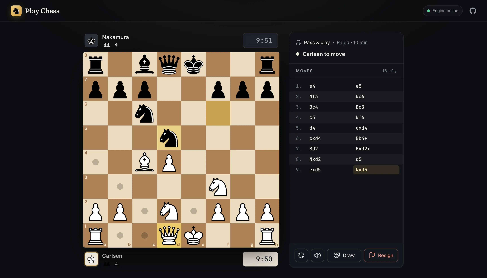

# Chess

A chess app you can play in the browser. You can pass the board back and forth with a friend on one screen, or play against Stockfish.

**Play it here:** https://kyle-close.github.io/chess/



## What it does

- Pass & play on one device. The board flips after each move so whoever's turn it is sees it from their side.
- Chess clocks: bullet (1 min), blitz (3), rapid (10) or classical (60).
- Play against Stockfish at any skill level from 0 to 20, as white, black or a random color.
- Start from any position by pasting in a FEN string.
- Click or drag to move. Legal moves are shown when you pick up a piece, and pawn promotion gets a picker right on the board.
- Draw offers, resigning, and the usual endings: checkmate, stalemate, threefold repetition, the 50-move rule, insufficient material and running out of time.
- Move list, captured pieces, material count and sounds.

## How it's put together

This repo is just the frontend. All of the actual chess logic lives in the backend, [chess-api](https://github.com/Kyle-Close/chess-api), which I also wrote. It's a .NET API that generates legal moves, checks for check/mate/draws, runs the clocks and talks to Stockfish. Games are saved in MongoDB.

The frontend never decides whether a move is legal. It asks the server for the game state, shows the moves the server says are allowed, and sends back whatever you play. The one shortcut is that your move shows up on the board right away instead of waiting for the server, and it gets rolled back if the server rejects it.

Frontend stack: React, TypeScript, Vite, Chakra UI, TanStack Query, React Hook Form and Zod (to validate the API responses).

The API is hosted on Fly.io and goes to sleep when nobody's using it, so the first game you start can take a few seconds. The little status light in the top bar tells you when it's awake.

## Running it locally

```
npm install
npm run dev
```

Then go to http://localhost:5173/chess/. The `/chess/` part matters because the app is set up to be served from that path on GitHub Pages.

By default it talks to the hosted API. To use a local copy of chess-api instead, change the URL in `src/features/api-utils/baseUrl.ts`. The API only allows requests from `localhost:5173` and the GitHub Pages site, so stick with the dev server port.

## Deploying

```
npm run deploy
```

This builds the app and pushes `dist/` to the `gh-pages` branch.

## Things I still want to do

- Online play against other people (the button's there, it just says "coming soon")
- Opening a `/play/...` link directly or refreshing the game page doesn't work yet
- Game review/analysis with Stockfish

## Credits

Piece images are the [cburnett set](https://commons.wikimedia.org/wiki/Category:SVG_chess_pieces) by Colin M.L. Burnett, the same pieces lichess uses.
